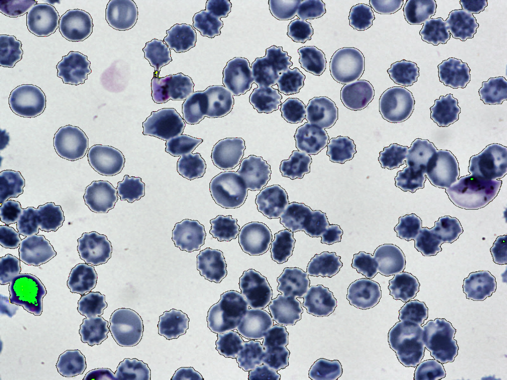

# Image-Segmentation-Blood-Cell (2023/08/15)
<h2>
1 Image-Segmentation-Blood-Cell 
</h2>

This is an experimental project for Image-Segmentation of Blood-Cell by using
 <a href="https://github.com/atlan-antillia/Tensorflow-Slightly-Flexible-UNet">Tensorflow-Slightly-Flexible-UNet</a> Model,
which is a typical classic Tensorflow2 UNet implementation <a href="./TensorflowUNet.py">TensorflowUNet.py</a> 

The image dataset used here has been taken from the following web site.

<pre>
Proposed Large Segmentation Dataset Download Link
2656 images are avilable. 1328 Original blood cell images with 1328 corresponding ground truths.
https://drive.google.com/file/d/1nG-ra6BPAZSTsdYCvedzCo-JLD7jdH71/view?usp=share_link

Citation
title={Automatic segmentation of blood cells from microscopic slides: a comparative analysis},
author={Depto, Deponker Sarker and Rahman, Shazidur and Hosen, Md Mekayel and Akter, 
Mst Shapna and Reme, Tamanna Rahman and Rahman, Aimon and Zunair, Hasib and Rahman, M Sohel and Mahdy, MRC},
journal={Tissue and Cell},
volume={73},
pages={101653},
year={2021},
publisher={Elsevier}
}
</pre>

 
 
<h2>
2. Install Image-Segmentation-Blood-Cell 
</h2>
Please clone Image-Segmentation-Blood-Cell.git in a folder <b>c:\google</b>. 
<pre>
>git clone https://github.com/sarah-antillia/Image-Segmentation-Blood-Cell.git 
</pre>
You can see the following folder structure in your working folder. 

<pre>
Image-Segmentation-Blood-Cell 
├─asset
└─projects
    └─-Blood-Cell
        ├─eval
        ├─generator
        ├─mini_test
        ├─models
        ├─Blood-Cell
        │   ├─test
        │   │  ├─images
        │   │  └─masks
        │   ├─train
        │   │  ├─images
        │   │  └─masks
        │   └─valid
        │       ├─images
        │       └─masks
        ├─test_output
        └─test_output_merged
</pre>

<h2>
3 Prepare dataset
</h2>

<h3>
3.1 Download master dataset
</h3>
  Please download the original image and mask dataset <b>Blood-Cell-Segmentation</b> from the following google drive  

Proposed Large Segmentation Dataset Download Link 
<pre>
2656 images are avilable. 1328 Original blood cell images with 1328 corresponding ground truths.
https://drive.google.com/file/d/1nG-ra6BPAZSTsdYCvedzCo-JLD7jdH71/view?usp=share_link
</pre>
The dataset <b>Blood-Cell Segmentation</b> has the following folder structure, which contains seven categories. 
<pre>
./New folder
├─Mask
└─Original
</pre>
The width of the Blood-Cell image and mask in these folders is from 2K to 3K, and they are not square size.
<h3>
3.2 Create image and mask dataset
</h3>
By using Python script <a href="./projects/Blood-Cell/generator/ImageMaskDatasetGenerator.py">ImageMaskDatasetGenerator.py</a>,
 we have created <b>Blood-Cell-master</b> dataset from the original image files in <b>Original</b> folder and mask files in <b>Mask</b>
 folder. 
The script performs the following image processings. 
<pre>
1 Create 512x512 square images from original Blood-Cell image files.
2 Create 512x512 square mask  corresponding to the Blood-Cell image files. 
3 Create rotated, flipped and mirrored images and masks of size 512x512 to augment the resized square images and masks.
</pre>

The created <b>Blood-Cell-master</b> dataset has the following folder structure. 
<pre>
./Blood-Cell-master
 ├─images
 └─masks
</pre>

<h3>
3.3 Split master to test, train and valid 
</h3>
By using Python script <a href="./projects/Blood-Cell/generator/split_master.py">split_master.py</a>,
 we have finally created <b>Blood-Cell</b> dataset from the Blood-Cell-master. 
<pre>
./Blood-Cell
├─test
│  ├─images
│  └─masks
├─train
│  ├─images
│  └─masks
└─valid
    ├─images
    └─masks
</pre>
<b>train/images samples:</b> 

 
<b>train/masks samples:</b> 

 

<h2>
4 Train TensorflowUNet Model
</h2>
 We have trained Blood-Cell TensorflowUNet Model by using the following
 <b>train_eval_infer.config</b> file.  
Please move to ./projects/Blood-Cell directory, and run the following bat file. 
<pre>
>1.train.bat
</pre>
, which simply runs the following command. 
<pre>
>python ../../TensorflowUNetTrainer.py ./train_eval_infer.config
</pre>
, where train_eval_infer.config is the following.
<pre>
; train_eval_infer.config
; Dataset of Blood-Cell
; 2023/08/15 (C) antillia.com

[model]
image_width    = 512
image_height   = 512
image_channels = 3
num_classes    = 1
base_filters   = 16
base_kernels   = (7,7)
num_layers     = 7
dropout_rate   = 0.07
learning_rate  = 0.0001
clipvalue      = 0.5
dilation       = (2,2)
loss           = "bce_iou_loss"
;metrics        = ["iou_coef", "sensitivity", "specificity"]
metrics        = ["iou_coef"]
show_summary   = False

[train]
epochs        = 100
batch_size    = 4
patience      = 10
metrics       = ["iou_coef", "val_iou_coef"]
model_dir     = "./models"
eval_dir      = "./eval"
image_datapath = "./Blood-Cell/train/images"
mask_datapath  = "./Blood-Cell/train/masks"
create_backup  = True

[eval]
image_datapath = "./Blood-Cell/valid/images"
mask_datapath  = "./Blood-Cell/valid/masks"
output_dir     = "./eval_output"
batch_size     = 4

[infer] 
images_dir = "./mini_test/images"
;images_dir = "./Blood-Cell/test/images"
output_dir = "./mini_test_output"
merged_dir = "./mini_test_output_merged"

[mask]
blur      = True
binarize  = True
threshold = 74

</pre>

Please note that the input image size and base_kernels size of this Blood-Cell TensorflowUNet model are slightly large. 
<pre>
[model]
image_width    = 512
image_height   = 512
base_kernels   = (7,7)
</pre>

The training process has just been stopped at epoch 52 by an early-stopping callback as shown below.  
 
 
 
<b>Train metrics line graph</b>: 
 
 
<b>Train losses line graph</b>: 
 

<h2>
5 Evaluation
</h2>
 We have evaluated prediction accuracy of our Pretrained Blood-Cell Model by using <b>valid</b> dataset. 
Please move to ./projects/Blood-Cell/ directory, and run the following bat file. 
<pre>
>2.evalute.bat
</pre>
, which simply runs the following command. 
<pre>
>python ../../TensorflowUNetEvaluator.py ./train_eval_infer.config
</pre>
The evaluation result is the following. 
 
 

<h2>
5 Inference 
</h2>
We have also tried to infer the segmented region for 
<pre>
images_dir    = "./mini_test/images" 
</pre> dataset defined in <b>train_eval_infer.config</b>,
 by using our Pretrained Blood-Cell UNet Model. 
Please move to ./projects/Blood-Cell/ directory, and run the following bat file. 
<pre>
>3.infer.bat
</pre>
, which simply runs the following command. 
<pre>
>python ../../TensorflowUNetInferencer.py ./train_eval_infer.config
</pre>

<b><a href="./projects/Blood-Cell/mini_test/images">Test input images</a> </b> 
 
 
<b><a href="./projects/Blood-Cell/mini_test/masks">Test input ground truth mask</a> </b> 
 
 

<b><a href="./projects/Blood-Cell/mini_test_output/">Inferred images </a>test output</b> 
 
 
 

<b><a href="./projects/Blood-Cell/mini_test_output_merged">Inferred merged images (blended test/images with 
inferred images)</a></b> 
  

<b>Some enlarged input images and inferred merged images</b> 
<table>
<tr>
<td>Input 2f9f400d-2d67-4118-aaa1-9094bc4b0e47.png</td><td>Inferred-merged 2f9f400d-2d67-4118-aaa1-9094bc4b0e47.png</td>
</tr>
<tr>
<td></td>
<td></td>
</tr>

<tr>
<td>Input 4f62b14e-c6f4-4155-8f50-881558f83fae.png</td><td>Inferred-merged 4f62b14e-c6f4-4155-8f50-881558f83fae.png</td>
</tr>
<tr>
<td></td>
<td></td>
</tr>

<tr>
<td>Input 7e25ced3-5caf-47f8-ad0c-42946bd4468b.png</td><td>Inferred-merged 7e25ced3-5caf-47f8-ad0c-42946bd4468b.png</td>
</tr>
<tr>
<td></td>
<td></td>
</tr>
<tr>
<td>Input 565513be-2c20-4ee3-94f3-093869515d3d.png</td><td>Inferred-merged 565513be-2c20-4ee3-94f3-093869515d3d.png</td>
</tr>
<tr>
<td></td>
<td></td>
</tr>

<tr>
<td>Input fb05b297-180a-4171-b633-09d5616d7534.png</td><td>Inferred-merged fb05b297-180a-4171-b633-09d5616d7534.png</td>
</tr>
<tr>
<td></td>
<td></td>
</tr>

</table>

 
<h3>
References
</h3>
<b>1. Automatic segmentation of blood cells from microscopic slides: A comparative analysis</b> 
Deponker Sarker Depto, Shazidur Rahman, Md. Mekayel Hosen, Mst Shapna Akter,  
Tamanna Rahman Reme, Aimon Rahman, Hasib Zunai, M. Sohel Rahman and M.R.C.Mahdy 
<pre>
Citation
title={Automatic segmentation of blood cells from microscopic slides: a comparative analysis},
author={Depto, Deponker Sarker and Rahman, Shazidur and Hosen, Md Mekayel and Akter, Mst Shapna and Reme, 
Tamanna Rahman and Rahman, Aimon and Zunair, Hasib and Rahman, M Sohel and Mahdy, MRC},
journal={Tissue and Cell},
volume={73},
pages={101653},
year={2021},
publisher={Elsevier}
}
</pre>
<pre>
https://github.com/Deponker/Blood-cell-segmentation-dataset
</pre>

